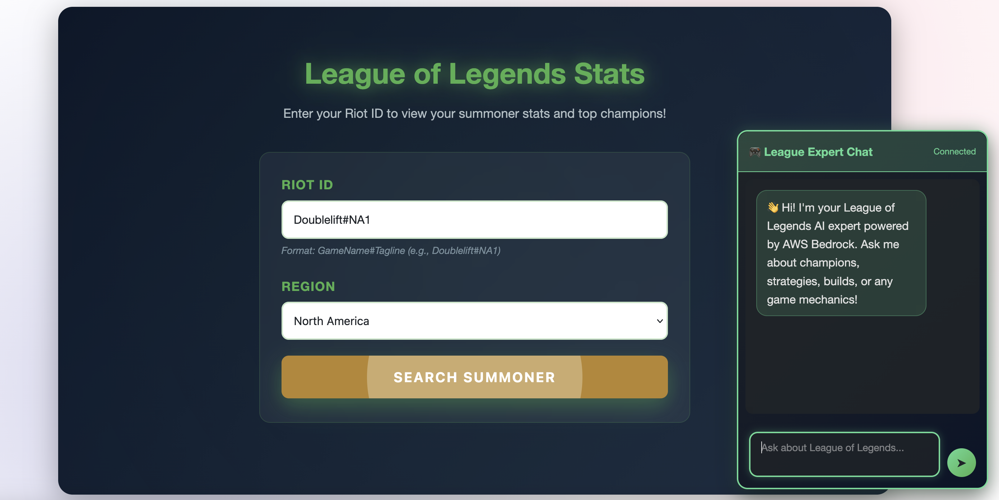
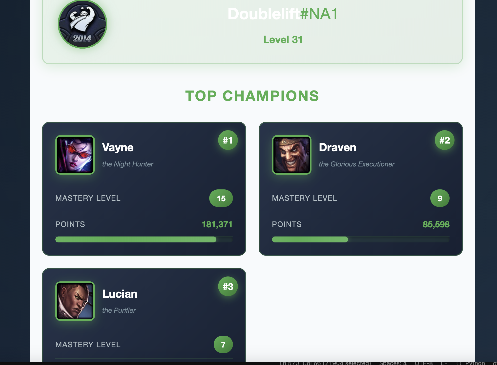
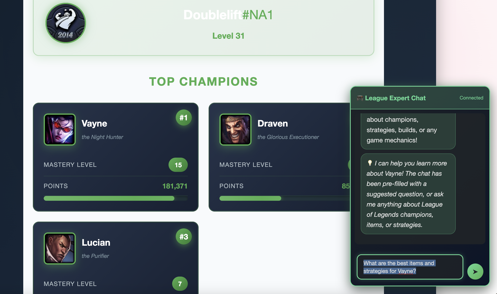
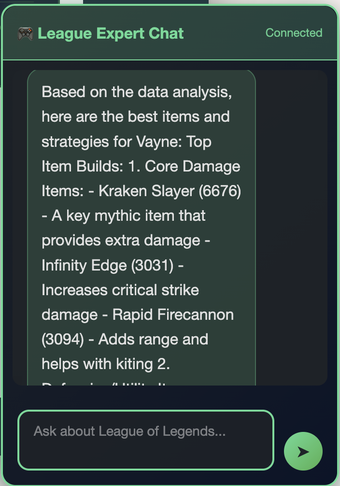
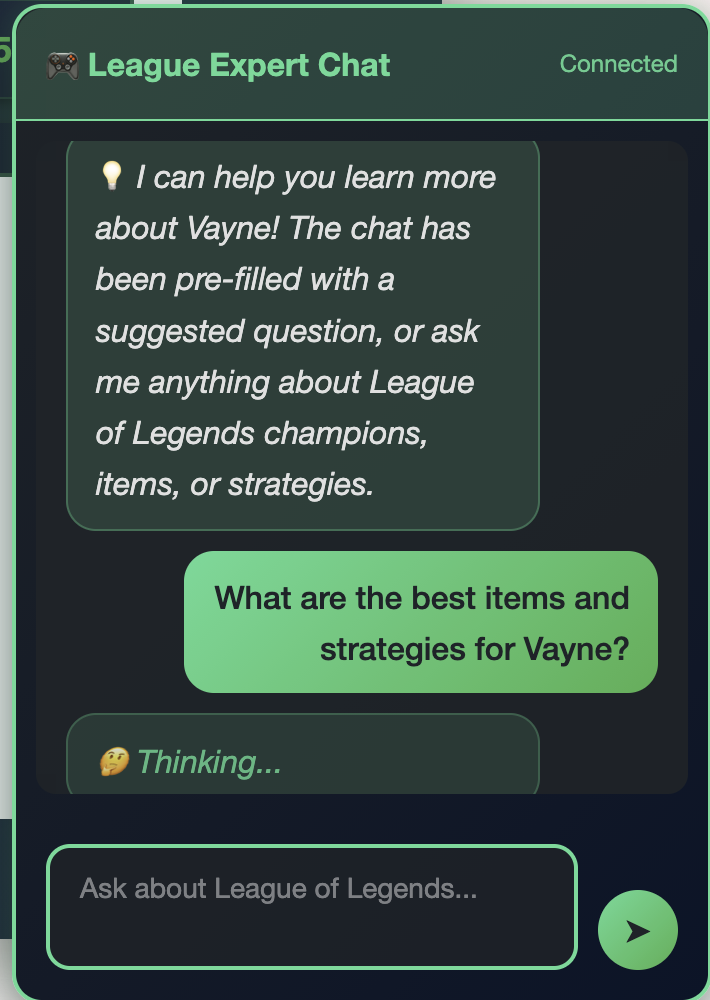

# rift-rewind-ml
# League of Legends AI Analytics Platform

Ever wondered what your most-played League champion's optimal build is, or wanted quick insights without tabbing out of your browser? This project combines real-time summoner stats with an AI-powered chat assistant to help League players get instant, data-driven answers about champions, strategies, and builds.

**🎮 [Try it live!](https://main.d34u5e3l1s0uex.amplifyapp.com/)**

## What It Does

This platform pulls together a few different pieces to create a seamless experience:

- **Summoner Lookup**: Enter any Riot ID and instantly see your profile stats and top 5 champions with mastery details
- **AI Chat Assistant**: Ask questions about League champions, items, strategies, or meta - powered by AWS Bedrock and a knowledge base of match data
- **Smart Integration**: Click any champion card from your lookup results, and the chat automatically suggests relevant questions about that champion
- **Progressive Loading**: The AI can take a moment to think through complex queries, so I added rotating status messages to keep things feeling responsive

## See It In Action

### The Interface

*League-themed design with summoner lookup and AI chat widget*

### Real-Time Summoner Data

*Live stats from Riot Games API - search any summoner to see their top 3 mastered champions*

### Smart Integration

*Click any champion card and the chat automatically suggests a question about that champion*

### AI-Powered Analysis


*AWS Bedrock analyzes match data to provide item builds, strategies, and performance insights*

### Progressive Feedback


*Rotating status messages keep you informed while the AI searches the knowledge base*

## The Journey

I started this as part of an AWS Builder hackathon challenge, but it turned into a really interesting exercise in optimization. The first version worked, but queries were taking nearly 2 minutes to complete. Through some architectural changes and model experimentation, I managed to get that down to about 17 seconds - an 85% improvement that makes the whole experience much more usable.

### Performance Evolution
- **Initial implementation**: 114 seconds per query (ouch!)
- **After switching from `retrieve_and_generate` to `retrieve` only**: 44 seconds
- **After moving to Claude 3.5 Haiku**: 17 seconds

The big breakthrough was realizing I was essentially running 3-4 separate LLM calls per question. By using the Knowledge Base to just fetch relevant data chunks and letting the main agent do all the synthesis in one go, things got way faster.

## Tech Stack

**Frontend**
- Static website (HTML/CSS/JavaScript)
- Hosted on AWS Amplify with GitHub integration for automatic deployments
- League of Legends themed with that signature gold and blue color scheme

**Backend**
- AWS Lambda for the chat agent
- WebSocket API Gateway for real-time messaging
- Python with the Strands AI framework for agent orchestration

**AI & Data**
- AWS Bedrock Knowledge Base with League match data
- Claude 3.5 Haiku (chose Haiku over Sonnet for better speed/cost without sacrificing too much quality)
- Vector search with 1000-token chunks
- Riot Games API for live summoner data

**Infrastructure**
- Everything deployed through AWS services
- GitHub → Amplify pipeline for the frontend
- Manual Lambda deployment for the backend

## Data Pipeline

One of the more interesting technical challenges was building the data collection and processing pipeline. I needed real League of Legends match data to populate the Knowledge Base, so I built a multi-stage pipeline:

**Collection → Aggregation → Indexing**

- Collected **517 high-elo matches** (Challenger, Grandmaster, Master) via Riot Games API
- Built Lambda functions for parallel match processing with DynamoDB caching to avoid duplicates
- Aggregated stats for **171 unique champions** across multiple patches
- Generated structured data: champion win rates, item builds, vision metrics, matchup data
- Indexed everything in AWS Bedrock Knowledge Base for semantic search

The result: when you ask "What are the best items for Jinx?", the AI is pulling from actual high-level ranked match data, not just generic guides.

**[See detailed pipeline documentation →](scripts/readme.md)**

## Project Structure

```
├── website/              # Frontend code (HTML/CSS/JS)
├── lambda/              # Backend Lambda function
├── data-collection/     # Scripts for gathering League match data
│   └── README.md        # Detailed pipeline documentation
└── architecture/        # Diagrams and documentation
```

## Features I'm Proud Of

**Real Match Data**: The AI isn't pulling from generic guides - it's trained on 517 actual high-elo ranked matches (Challenger through Master tier) with statistics for 171 unique champions. This means the recommendations are based on what's actually working at the highest levels of play.

**Clickable Champion Cards**: When you look up a summoner, you can click any of their top champions to automatically populate the chat with a relevant question. It's a small thing, but it creates a nice flow between the two features.

**Progressive Thinking Messages**: Since AI responses take 15-20 seconds, I added rotating status messages ("🤔 Thinking...", "📚 Searching knowledge base...", etc.) that update every 15 seconds. It's a simple UX touch that makes the wait feel more intentional.

**Graceful Degradation**: The Riot API has daily rate limits, but the AI chat keeps working regardless. And if the AI can't find data for a specific query, it tells you that upfront rather than making something up.

## The Technical Challenges

**Challenge #1: Response Time**
My first implementation was using `retrieve_and_generate` for each tool call, which meant the Knowledge Base was generating complete responses that my main agent would then process and generate another response from. This created a cascade of LLM calls. Switching to `retrieve` only and letting the agent synthesize everything once cut response time by more than half.

**Challenge #2: Model Selection**
Claude Sonnet gives more detailed responses, but Haiku is faster and way cheaper to run. For factual League of Legends queries ("What items should I build on Jinx?"), Haiku turned out to be plenty good enough. The speed improvement was noticeable.

**Challenge #3: Input Visibility**
Small thing, but the chat input was cutting off longer questions. Switching from a single-line input to a multi-line textarea (while keeping Enter to send, Shift+Enter for new lines) made a big difference in usability.

## What I'd Do Differently

If I were starting over or had more time:

- **Streaming responses**: Right now you wait 17 seconds and get everything at once. Streaming would let users see the response build up in real-time, which feels much faster even if it takes the same amount of time
- **Reduce chunk size**: My Knowledge Base is using 1000-token chunks right now. Dropping to 400-500 tokens would probably speed up vector search and make results more precise
- **Cache common queries**: Questions like "best items for [popular champion]" get asked a lot. Caching these for a few hours could cut response time dramatically
- **Persistent conversation memory**: Currently conversation history resets on page refresh. Adding localStorage persistence would let users pick up where they left off

## Running It Yourself

The live demo is up at [https://main.d34u5e3l1s0uex.amplifyapp.com/](https://main.d34u5e3l1s0uex.amplifyapp.com/), but if you want to deploy your own version, you'll need:

1. An AWS account with Bedrock access
2. A Riot Games API key (free tier is fine for testing)
3. Some League of Legends match data to populate the Knowledge Base
4. The Lambda code configured with your WebSocket API Gateway

Check out the individual README files in the `lambda/` and `data-collection/` folders for detailed setup instructions.

## What I Learned

This was my first real project using AWS Bedrock and Knowledge Bases, and honestly, there was a lot of trial and error. The documentation is good, but there are nuances around chunking strategies, retrieval methods, and model selection that you only figure out by building something real.

The optimization process was particularly interesting - going from "it works but it's slow" to "it works and it's actually usable" taught me a lot about where time gets spent in AI applications. It's rarely where you think it is.

## Hackathon Context

Built for the AWS Builder Challenge hackathon. The goal was to create an AI agent using AWS services, and I wanted to make something that combined real-time data (Riot API) with historical insights (Knowledge Base) in a way that felt cohesive.

## About Me

I'm Mike Little, currently working in financial services designing products and architecture. This was a fun side project to explore AWS AI services in a completely different domain. If you want to connect or have questions about the project, feel free to reach out on [LinkedIn](https://www.linkedin.com/in/michaelflittle/).

---

**Note**: This project uses the Riot Games API but isn't endorsed by Riot Games and doesn't reflect the views or opinions of Riot Games or anyone officially involved in producing or managing Riot Games properties.
